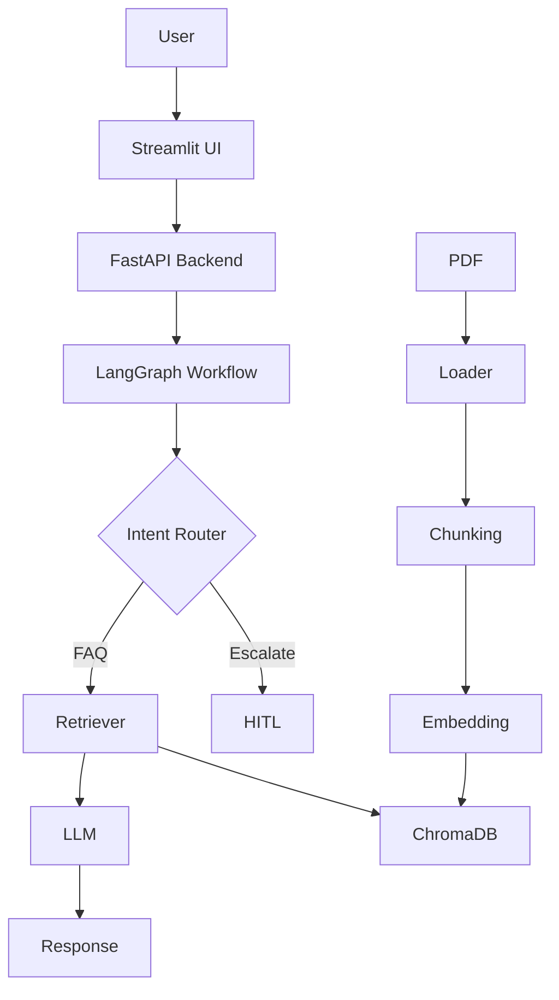

# 🚀 RAG-Based Customer Support Assistant

An end-to-end **Retrieval-Augmented Generation (RAG)** system that processes PDF knowledge bases and answers user queries using contextual retrieval, **LangGraph workflow orchestration**, and **Human-in-the-Loop (HITL)** escalation.

---

## 📌 Overview

Customer support teams often rely on large PDF documents (manuals, FAQs, SOPs). Searching through them manually is slow and inefficient.

This system automates that process by:

* Extracting knowledge from PDFs
* Retrieving relevant context using embeddings
* Generating grounded answers with an LLM
* Escalating uncertain queries to human agents

---

## 🧠 Features

* 📄 PDF Upload & Processing
* ✂️ Intelligent Text Chunking
* 🔎 Semantic Search with Vector DB (ChromaDB)
* 🤖 LLM-based Answer Generation (OpenRouter)
* 🔄 Graph-based Workflow (LangGraph)
* 🚦 Intent Detection & Routing
* 👨‍💻 Human-in-the-Loop Escalation
* 🖥️ Streamlit UI for interaction

---

## 🏗️ System Architecture



---

## ⚙️ Tech Stack

* **Backend:** FastAPI
* **Frontend:** Streamlit
* **LLM:** OpenRouter (GPT models)
* **Embeddings:** Sentence Transformers
* **Vector DB:** ChromaDB
* **Workflow Engine:** LangGraph

---

## 📂 Project Structure

```
rag-customer-support/
│
├── app/
│   ├── api/
│   ├── ingestion/
│   ├── retrieval/
│   ├── llm/
│   ├── workflow/
│   ├── hitl/
│
├── frontend/
├── data/
├── db/
├── tests/
```

---

## 🚀 Getting Started

### 1. Clone the repo

```bash
git clone https://github.com/Anharo/rag-customer-support.git
cd rag-customer-support
```

### 2. Install dependencies

```bash
pip install -r requirements.txt
```

### 3. Set environment variables

Create a `.env` file:

```
OPENROUTER_API_KEY=your_api_key_here
```

### 4. Run backend

```bash
uvicorn app.main:app --reload
```

### 5. Run frontend

```bash
streamlit run frontend/app.py
```

---

## 🧪 Usage

1. Upload a PDF
2. Ask questions
3. View:

   * Answer
   * Retrieved context
   * Intent classification
   * Escalation status

---

## 🧠 Example Queries

* "Who is Aruko?"
* "What is happening in the story?"
* "I have a complaint"

---

## ⚠️ Challenges & Trade-offs

* Retrieval quality depends on chunking
* Story-based PDFs lack structured answers
* Larger context improves accuracy but increases latency

---

## 🔮 Future Improvements

* Multi-document support
* Feedback learning loop
* Better reranking models
* Chat history / memory
* Deployment (Render / AWS)

---

## 🏁 Conclusion

This project demonstrates how **RAG + LangGraph + HITL** can be combined to build a reliable, scalable customer support system.

It goes beyond a simple chatbot by introducing:

* Retrieval grounding
* Workflow orchestration
* Human fallback mechanisms

---

## 👨‍💻 Author

Anish Sharma

---

⭐ If you found this useful, consider giving it a star!
